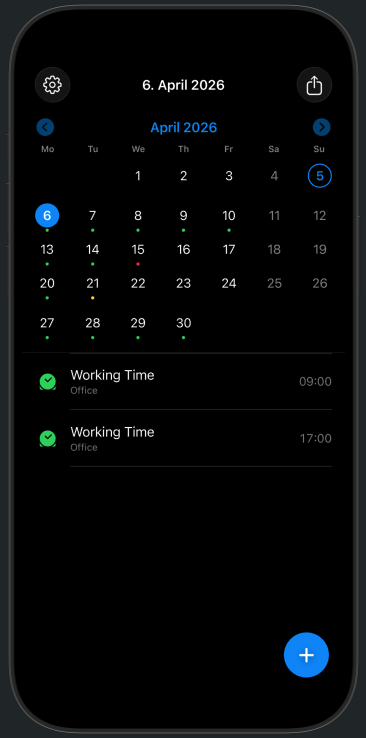
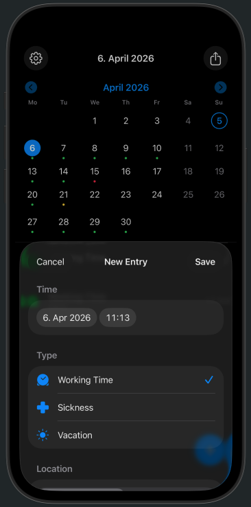
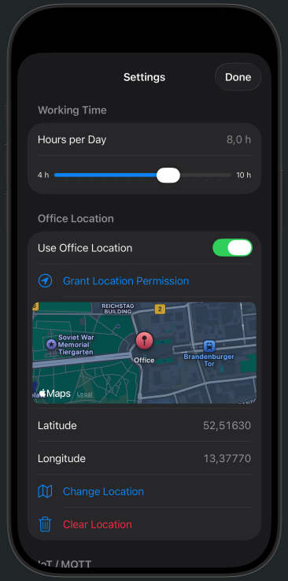
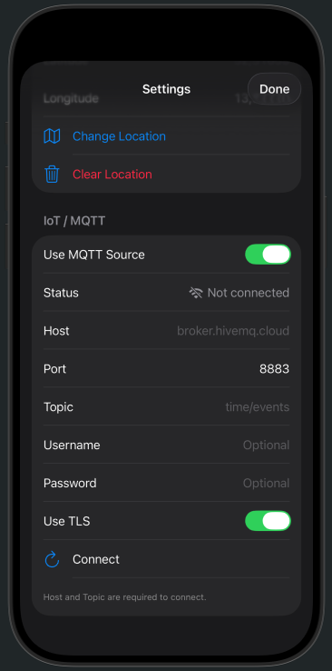
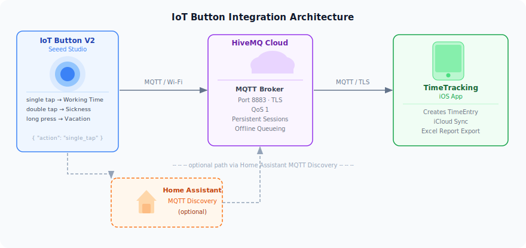

# TimeTracking

A personal iOS time tracking app for logging daily work events, automatically detecting office arrivals via geofencing, and exporting monthly reports as Excel files. Optionally integrates with a physical IoT button to log events without opening the app.

Built with SwiftUI + SwiftData, synced across devices via iCloud, and requiring no third-party dependencies.

---

## Screenshots

<p float="left">
  
  
  
  
</p>

---

## Features

### Time Entry Logging
- Log three entry types: **Working Time**, **Sickness**, and **Vacation**
- Each entry captures a timestamp and — for working time — a work location (Home Office or Office)
- Add entries manually via an in-app sheet or automatically via geofencing or an IoT button

### Calendar View
- Month calendar with colour-coded indicators per day
- Tap any day to see its entries with timestamps
- Navigate between months with previous/next controls

### iCloud Sync
- All entries and settings sync automatically across your devices via CloudKit (private database)
- No account setup required beyond the iCloud account already on your device

### Office Location Detection
- Configure your office coordinates once in Settings
- The app monitors a 100 m geofence around your office
- Entering the geofence automatically logs a **Working Time / Office** entry; leaving logs a **Working Time / Home Office** entry
- When adding an entry manually, the app can detect your current location and pre-select the work location for you

### Monthly Excel Report
- Export a full monthly report as an `.xlsx` file via the share sheet
- One row per calendar day, always covering the complete month
- **Columns:** Date · Type · Location (optional) · Start · End · Hours
- **Hours** calculated from paired entry timestamps; a single unpaired entry uses your configured default hours
- Sickness and vacation carry forward to subsequent empty days until the next explicit entry
- **Formatting:**
  - Header row: bold with bottom border
  - Weekend rows: light grey background
  - Sickness rows: light red background
  - Vacation rows: light orange background
  - Last data row: bottom border
  - Summary row: total working hours for the month in bold
- Column widths auto-sized to content; hours formatted as `H:mm`

### IoT Button Integration *(optional)*
Log work events with a physical button press — no phone interaction required. See [IoT Button Setup](#iot-button-setup) below.

---

## Requirements

- iOS 26.2 or later
- Xcode 26.3 or later
- An iCloud account (for CloudKit sync)
- Location permission set to **Always** (for geofencing — optional)

---

## Getting Started

1. Clone the repository:
   ```bash
   git clone https://github.com/your-username/TimeTracking.git
   cd TimeTracking
   ```

2. Open `TimeTracking.xcodeproj` in Xcode.

3. Select your development team in **Signing & Capabilities** and replace the iCloud container identifier `iCloud.de.tommzn.TimeTracking` with your own (e.g. `iCloud.com.yourname.TimeTracking`) in both:
   - **Signing & Capabilities → iCloud → Containers**
   - `TimeTracking/TimeTrackingApp.swift` — the `ModelConfiguration` call

4. Build and run on a device or simulator.

> **Note:** CloudKit sync requires a physical device. The simulator can run the app but will use a local-only store.

---

## Configuration

### Working Hours
Set your default working hours per day (4–10 h) in **Settings**. This value is used when a day has only a single unpaired working-time entry.

### Office Location
1. Open **Settings → Office Location**
2. Enable **Use Office Location**
3. Grant **Always** location permission when prompted
4. Tap **Change Location** and pick your office on the map

Once configured, the app automatically creates entries when you arrive at or leave the office.

### MQTT / IoT Button
See the [IoT Button Setup](#iot-button-setup) section below.

---

## IoT Button Setup

The app supports receiving time events from a physical button over MQTT. This lets you log the start or end of a work day, a sick day, or a vacation day with a single button press — even before you unlock your phone.

### Hardware

**[Seeed Studio IoT Button V2](https://wiki.seeedstudio.com/iot_button_v2_ha_discovery/)**

A small Wi-Fi connected button that publishes an MQTT message on each press action:

| Button action | Entry type logged |
|---|---|
| Single tap | Working Time |
| Double tap | Sickness |
| Long press | Vacation |

### Architecture



### MQTT Broker — HiveMQ

The app is configured to work with [HiveMQ Cloud](https://www.hivemq.com/mqtt-cloud-broker/) (free tier available).

1. Create a free cluster at [hivemq.com](https://www.hivemq.com)
2. Note your **host**, **port** (8883 for TLS), and create credentials
3. In the app: **Settings → IoT / MQTT**
   - Enable **Use MQTT Source**
   - Enter Host, Port, Topic, Username, and Password
   - Leave **Use TLS** enabled
   - Tap **Connect**

The app uses a persistent MQTT session (QoS 1, `cleanSession = false`) with a stable client ID stored in UserDefaults. Messages published while the app is in the background or offline are queued by the broker and delivered automatically on the next connection.

### Home Assistant Integration

The Seeed Studio IoT Button V2 can be integrated with [Home Assistant](https://www.home-assistant.io) via MQTT Discovery, which makes the button appear automatically as a device in HA. Home Assistant can then forward button events to your HiveMQ broker topic.

Follow the official guide: [IoT Button V2 + Home Assistant MQTT Discovery](https://wiki.seeedstudio.com/iot_button_v2_ha_discovery/)

### Expected MQTT Payload

The app expects a JSON payload on the configured topic:

```json
{ "action": "single_tap" }
```

Valid `action` values: `single_tap`, `double_tap`, `long_tap`.

### Testing with mosquitto_pub

A helper script is included for manual testing:

```bash
# Configure via environment variables
export MQTT_HOST=your-cluster.hivemq.cloud
export MQTT_PORT=8883
export MQTT_TOPIC=time/events
export MQTT_USER=your-username
export MQTT_PASS=your-password

./mqtt-publish.sh single_tap   # Working Time
./mqtt-publish.sh double_tap   # Sickness
./mqtt-publish.sh long_tap     # Vacation
```

Requires [mosquitto](https://mosquitto.org) (`brew install mosquitto`).

---

## Tech Stack

| Area | Technology |
|---|---|
| UI | SwiftUI |
| Data / persistence | SwiftData |
| Cloud sync | CloudKit (private database) |
| Location / geofencing | CoreLocation |
| MQTT | Pure-Swift implementation over `Network.framework` — no third-party packages |
| Excel export | Pure-Swift XLSX writer — no third-party packages |
| Credentials | Keychain |
| Tests | Swift Testing framework |

---

## Tests

The project has comprehensive unit test coverage for all business logic:

```bash
xcodebuild test -scheme TimeTracking -sdk iphonesimulator
```

Test targets cover: data model, time entry store, settings, keychain, location manager, month report generator, Excel exporter, and MQTT manager public interface.

---

## Project Structure

```
TimeTracking/
├── TimeTrackingApp.swift       # App entry point, dependency setup
├── ContentView.swift           # Main calendar + entry list view
├── SettingsView.swift          # Settings sheet
├── Item.swift                  # EntryType, WorkLocation, TimeEntry model
├── AppSettings.swift           # AppSettings model
├── TimeEntryStore.swift        # Entry persistence and queries
├── SettingsStore.swift         # Settings persistence
├── LocationManager.swift       # Geofencing and location detection
├── MQTTManager.swift           # MQTT client and IoT message handling
├── KeychainStore.swift         # Secure credential storage
├── MonthReport.swift           # Monthly report data generation
└── XLSXExporter.swift          # Excel file writer
docs/
└── screenshots/                # App screenshots
mqtt-publish.sh                 # Manual MQTT test script
```

---

## License

This project is released under the MIT License. See [LICENSE](LICENSE) for details.
